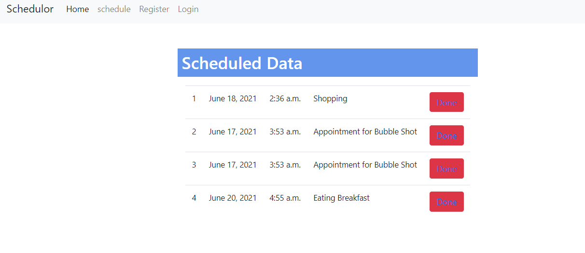

# Introduction

This is a simple scheduling making website made in django. To kickstart your journey in django you can go for this project in your learning phase of django.

### Main features

* Register and Login so that only you can see your appointments

* Schedule Your Important Thing to do

* Easy to check your appointments

* Futute Enchancement: Email Alert System

### Existing virtualenv

If your project is already in an existing python3 virtualenv first install django by running

    $ pip install django
    
And then run the `django-admin.py` command to start the new project:

    $ django-admin.py startproject \
      --template=https://github.com/abhi526691/ScheduleMaker \
      --extension=py,md \
      <ScheduleMaker>
      
### No virtualenv

Installing inside virtualenv is recommended, however you can start your project without virtualenv too.

If you don't have django installed for python 3 then run:

    $ pip3 install django
    
And then:

    $ python3 -m django startproject \
      --template=https://github.com/abhi526691/ScheduleMaker \
      --extension=py,md \
      <ScheduleMaker>
      
      
After that just install the local dependencies, run migrations, and start the server.



# ScheduleMaker

# Getting Started

First clone the repository from Github and switch to the new directory:

    $ git clone git@https://github.com/abhi526691/ScheduleMaker{{ ScheduleMaker }}.git
    $ cd {{ ScheduleMaker }}
    
Activate the virtualenv for your project.
    
Install project dependencies:

    $ pip install -r requirements.txt
    
    
Then simply apply the migrations:

    $ python manage.py migrate
    

You can now run the development server:

    $ python manage.py runserver
    
    
    
<!-- CONTACT -->
## Contact

Abhishek Pandey - [linkedin](https://www.linkedin.com/in/abhishek-pandey-1515aa171/) - sauravpandey597@gmail.com

Project Link: [https://github.com/abhi526691/ScheduleMaker/](https://github.com/abhi526691/ScheduleMaker/)
